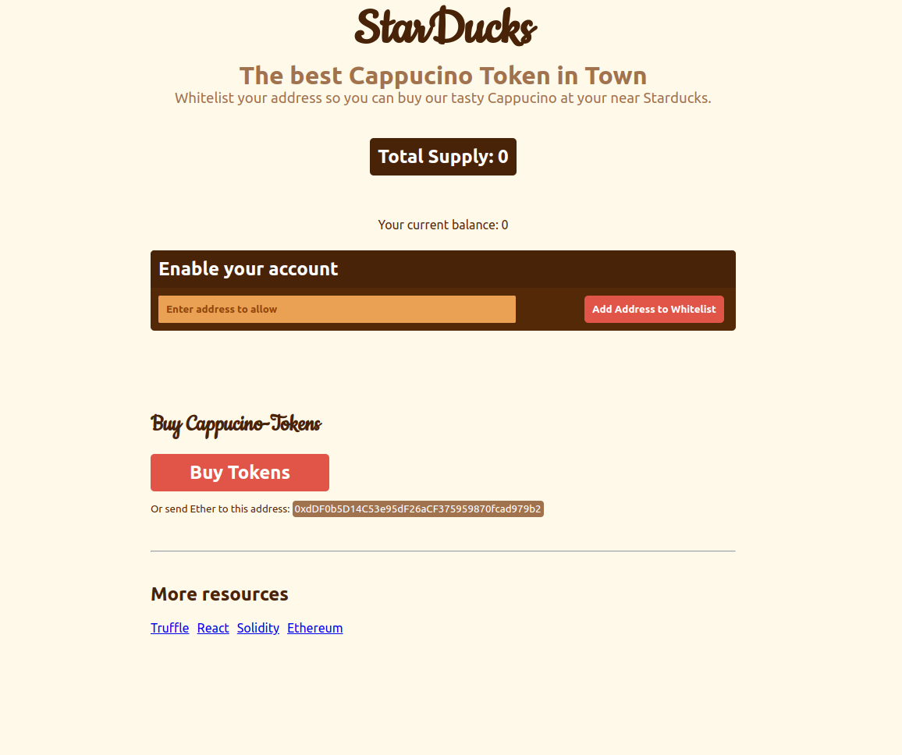

<!-- REQUIREMENTS -->

<center></center>
### ABOUT THE EXERCISE/PRACTICE PROJECT
This is an asset tokenization project built with the following use cases:
💰 Tokenization of any Assets as fungible Tokens (ERC20)   
🏦 Creation of Bonus Programs, Vouchers, etc.   
💲 Creation of a new cryptocurrency   
🧾 Creation of a Payment-layer on top of the Ethereum  

This example project was built with the following purpose:
🧰 Understand truffle-config JSON file
🤖 Understand deployment of dApps
🦸‍♂️ Understand Tokenization using Open-Zeppelin Smart Contracts
☑️ Deeper dive into Unit-Testing

<!-- BUILT WITH -->
### Built With
* Solidity
* React

### Run With
* Truffle
* Ganache
* Metamask

<!-- GETTING STARTED -->
## Getting Started
For this project, there is a set of tools required to run the project. Follow the instructions in the following sections to get it all set up.
This project was built following [these instructions](https://ethereum-blockchain-developer.com/060-tokenization/12-metamask-deployment/). Some of the steps given here, show how to run the project.

### Prerequisites
To run the project, you'll need to have `node`(v12 or later)  & `npm` installed. 
To check if the tools have been installed, run the following commands on a terminal window:
```sh
npm -v
node -v
git --version
```
If an error or a message is displayed instead of a version output, it means you'll have to install them. You can search for how to install them on Windows & Mac. The commands shown in this section were run on Ubuntu 20.04 LTS. For Windows, you can run on a WSL terminal.
To install these tools, run the following commands (Linux):
```sh
sudo apt install node
```
```sh
sudo apt install npm
```

Also, to test this project you'll need a [Metamask](https://metamask.io/) account set up.

### Install Truffle
To install `Truffle`, run the following command:
```sh
sudo npm install -g truffle
```
This will install Truffle in your global npm directory.

### Running the project
Before starting the project, run the following commands in the `client` and `truffle` folders.
In the `client` folder, run `npm run start` to start the local react server.  
For other instructions on how to make the project work you your local machine, follow the steps on this [website](https://ethereum-blockchain-developer.com/060-tokenization/12-metamask-deployment/).   
But before, install the [ganache](https://trufflesuite.com/docs/ganache/) blockchain development network. Double-check if the network config parameters in the `/truffle/truffle-config.js` under <i>ganache_local</i> are the same provided by ganache in your system.

### Running the project on Ganache🍫
After, installing ganache, run the following command:
```sh
truffle migrate --network ganache_local
```
The network configurations have already been added to the `truffle-config.js` file.


<!-- CONTACT -->
## Contributing

Contributions are what makes the open-source community such an amazing place to learn, inspire, and create. Any contributions you make are **greatly appreciated**.

If you have a suggestion that would make this better, please fork the repo and create a pull request. You can also simply open an issue with the tag "enhancement".
Don't forget to give the project a star! Thanks again!

1. Fork the Project
2. Create your Feature Branch (`git checkout -b feature/AmazingFeature`)
3. Commit your changes (`git commit -m 'Add some AmazingFeature'`)
4. Push to the Branch (`git push origin feature/AmazingFeature`)
5. Open a Pull Request


<!-- License -->
## License
Distributed under the MIT License. See `LICENSE.txt` for more information.


## Acknowledgments
[Readme File Template](https://github.com/othneildrew/Best-README-Template/blob/master/README.md?plain=1)   
[openzepellin](https://github.com/OpenZeppelin/openzeppelin-contracts/tree/master)  
Instructor👨‍🏫: [Thomas Wiesner](https://ethereum-blockchain-developer.com/000-introduction/01-your-instructor/)


## Contacts
[![@nozotrox][Twitter-badge]](https://twitter.com/nozotrox)   
[![@nozotrox][Github-badge]](https://github.com/nozotrox)  
[![@nozotrox][LinkedIn-badge]](http://www.linkedin.com/in/feliciano-jr-mazoio)   
![feliciano.j.a.mazoio@gmail.com][Gmail-badge]


[Twitter-badge]:https://img.shields.io/badge/Twitter-1DA1F2?style=social&logo=twitter&logoColor=blue&label=@nozotrox
[Github-badge]:https://img.shields.io/badge/GitHub-100000?style=social&logo=github&label=nozotrox&logoColor=#242424
[LinkedIn-badge]:https://img.shields.io/badge/LinkedIn-0077B5?style=social&logo=linkedin&label=Feliciano_Mazoio&logoColor=blue
[Gmail-badge]:https://img.shields.io/badge/Gmail-D14836?style=social&logo=gmail&label=feliciano.j.a.mazoio@gmail.com&logoColor=red